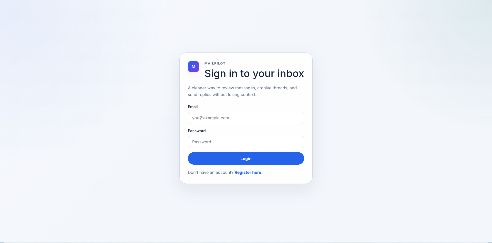
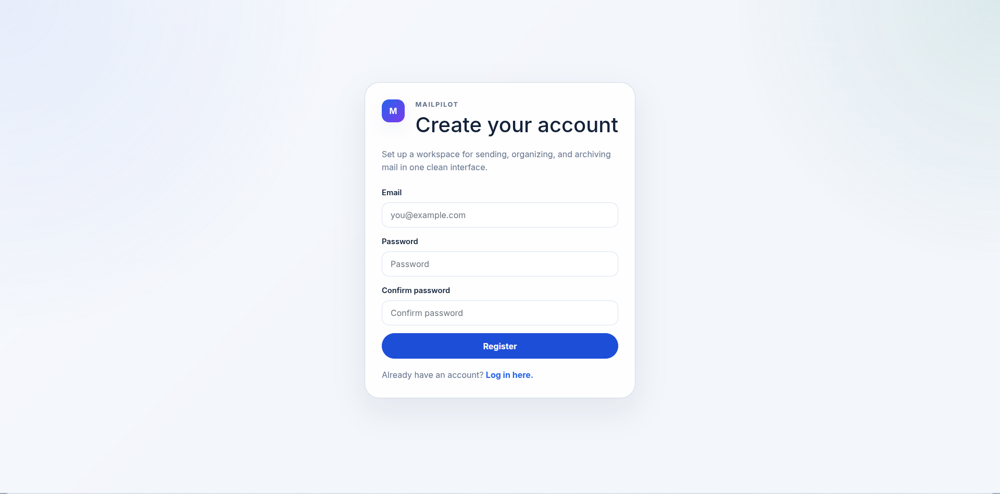
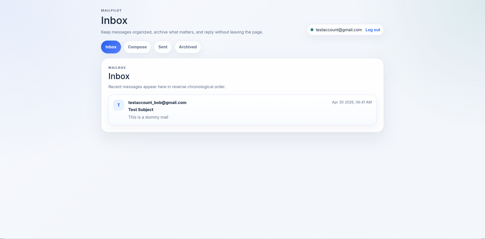
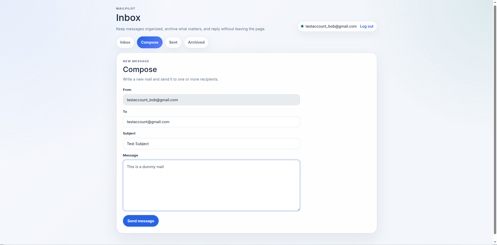

# MailPilot

MailPilot is a Django-based email client built for practicing full-stack web development with authentication, mailbox navigation, message composition, archiving, and reply flows.

## Overview

The application provides a lightweight mail experience with:

- user registration and login
- an inbox for incoming mail
- a sent mailbox for outbound mail
- an archive for stored messages
- message detail views
- compose and reply actions
- a JSON API used by the front-end mailbox interface

## Tech Stack

- Python
- Django
- SQLite
- HTML templates
- JavaScript for mailbox interactions
- Bootstrap for basic layout styling

## Project Structure

- `manage.py` - Django management entry point
- `mail/` - the main app containing models, views, templates, and static assets
- `mailpilot/` - Django project settings and root URL configuration
- `db.sqlite3` - local SQLite database used during development

## Features

### Authentication

- New users can register with an email address and password.
- Existing users can sign in and sign out.
- Unauthenticated users are redirected to the login screen.

### Mailboxes

- Inbox: shows unread and received messages.
- Sent: shows messages sent by the signed-in user.
- Archive: shows archived received messages.

### Message Actions

- Compose a new message to one or more recipients.
- Open a message to mark it as read.
- Archive or unarchive a message from the detail view.
- Reply to a message with the recipient and subject pre-filled.

## Setup

Create a virtual environment and install dependencies:

```bash
python3 -m venv .venv
source .venv/bin/activate
pip install -r requirements.txt
```

Run database migrations:

```bash
python manage.py migrate
```

Start the development server:

```bash
python manage.py runserver
```

Open the app in your browser at:

```text
http://127.0.0.1:8000/
```

## Usage

1. Register a new account at `/register`.
2. Log in with the account you created.
3. Use the mailbox buttons to switch between Inbox, Sent, and Archived views.
4. Click `Compose` to send a new message.
5. Open a message to read it, archive it, or reply.

## API Routes

The front-end mailbox is powered by the following routes:

- `GET /` - inbox landing page for authenticated users
- `GET|POST /login` - login form and login submission
- `GET|POST /register` - registration form and account creation
- `GET /logout` - log out the current user
- `POST /emails` - create and send a message
- `GET /emails/<mailbox>` - list messages for `inbox`, `sent`, or `archive`
- `GET /emails/<id>` - fetch a single message
- `PUT /emails/<id>` - mark a message as read or archived

## Screenshot Placeholders

Replace the image paths below with screenshots from your local run.

### Login



### Registration



### Inbox



### Compose



### Message Detail


### Archived Mail


## Recommended Screenshot Order

If you want the README to feel complete, capture screenshots in this order:

1. Login page
2. Registration page
3. Inbox with a few messages visible
4. Compose view with filled-in recipient and subject fields
5. Single message detail view
6. Archived mailbox

## Notes

- The app uses a local SQLite database, so your test data will remain in `db.sqlite3`.
- Some compose and reply flows require at least two user accounts so you can send mail between them.
- The current UI is intentionally simple and functional, which makes screenshots easy to read.
